# Полная аналитика рынка строительных инструментов в Узбекистане

## Содержание
1. [Графики и визуализация данных](#графики-и-визуализация-данных)
2. [Обзор рынка](#обзор-рынка)
3. [Статистика и объемы рынка](#статистика-и-объемы-рынка)
4. [Тенденции развития](#тенденции-развития)
5. [Покупательская способность](#покупательская-способность)
6. [Конкурентная среда](#конкурентная-среда)
7. [Анализ импорта и экспорта](#анализ-импорта-и-экспорта)
8. [Анализ новостей и событий](#анализ-новостей-и-событий)
9. [Стратегии продаж](#стратегии-продаж)
10. [Выводы и рекомендации](#выводы-и-рекомендации)

---

## Графики и визуализация данных

В данном разделе представлены наглядные графики по всем ключевым показателям рынка строительных инструментов Узбекистана.

### 1. Динамика объема рынка строительных материалов и инструментов (2024-2029)

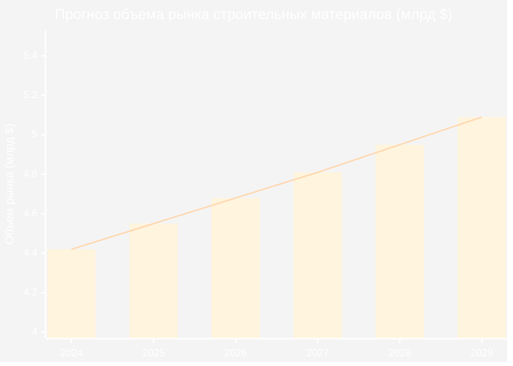
```mermaid
%%{init: {'theme': 'base', 'themeVariables': { 'primaryColor': '#4CAF50', 'primaryTextColor': '#fff', 'primaryBorderColor': '#388E3C', 'lineColor': '#2196F3', 'secondaryColor': '#81C784'}}}%%
xychart-beta
    title "Прогноз объема рынка строительных материалов (млрд $)"
    x-axis [2024, 2025, 2026, 2027, 2028, 2029]
    y-axis "Объем рынка (млрд $)" 4.0 --> 5.5
    bar [4.42, 4.55, 4.68, 4.81, 4.95, 5.09]
    line [4.42, 4.55, 4.68, 4.81, 4.95, 5.09]
```

> **CAGR 2024-2029: 2,86%** | Объем рынка вырастет с $4,42 млрд до $5,09 млрд

---

### 2. Доля рынка по странам-производителям (количество компаний)

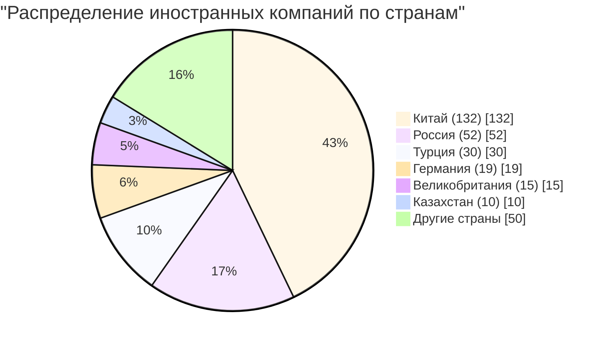
```mermaid
%%{init: {'theme': 'base'}}%%
pie showData
    title "Распределение иностранных компаний по странам"
    "Китай (132)" : 132
    "Россия (52)" : 52
    "Турция (30)" : 30
    "Германия (19)" : 19
    "Великобритания (15)" : 15
    "Казахстан (10)" : 10
    "Другие страны" : 50
```

> **75% рынка** контролируется иностранными компаниями | **25%** - узбекские производители

---

### 3. Структура рынка: иностранные vs местные компании

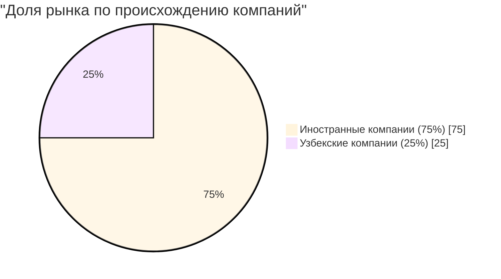
```mermaid
%%{init: {'theme': 'base'}}%%
pie showData
    title "Доля рынка по происхождению компаний"
    "Иностранные компании (75%)" : 75
    "Узбекские компании (25%)" : 25
```

---

### 4. Динамика прямых иностранных инвестиций (FDI)

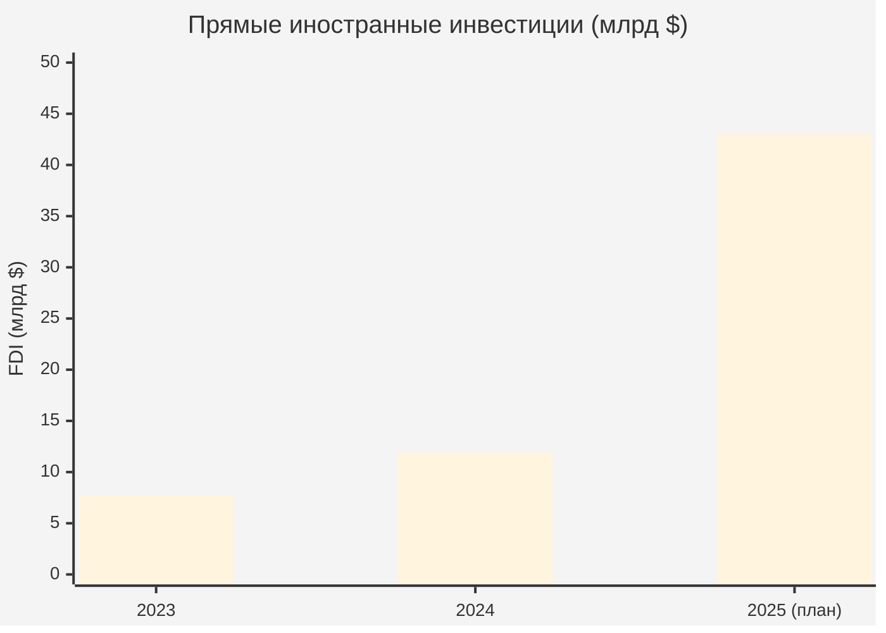
```mermaid
%%{init: {'theme': 'base', 'themeVariables': { 'primaryColor': '#2196F3'}}}%%
xychart-beta
    title "Прямые иностранные инвестиции (млрд $)"
    x-axis ["2023", "2024", "2025 (план)"]
    y-axis "FDI (млрд $)" 0 --> 50
    bar [7.75, 11.9, 43]
```

> **Рост FDI в 2024: +53,6%** | Цель на 2025: $43 млрд (+261,3%)

---

### 5. Рост FDI относительно ВВП

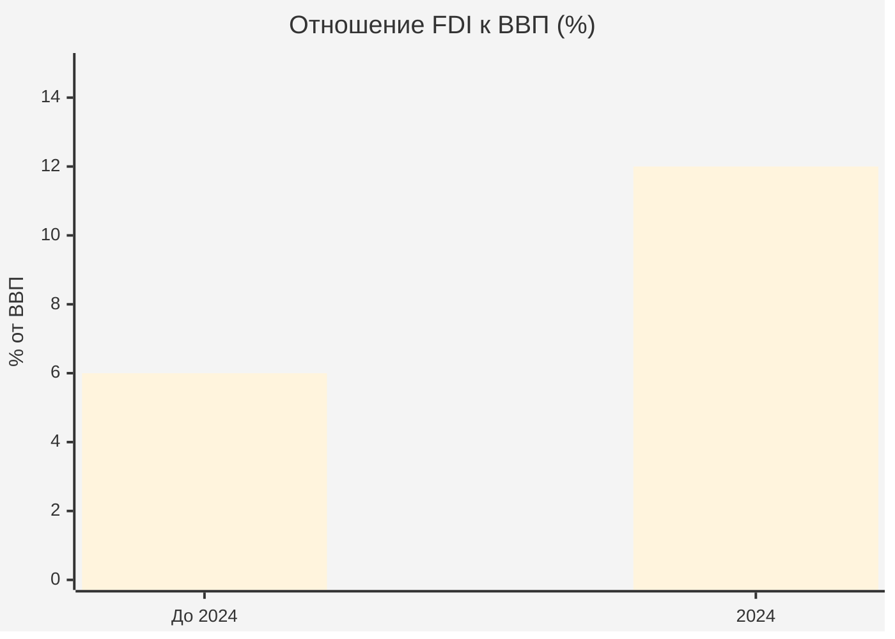
```mermaid
%%{init: {'theme': 'base'}}%%
xychart-beta
    title "Отношение FDI к ВВП (%)"
    x-axis ["До 2024", "2024"]
    y-axis "% от ВВП" 0 --> 15
    bar [6, 12]
```

> Доля FDI в ВВП выросла с **6% до 12%**

---

### 6. Рост строительной отрасли (в реальном выражении)

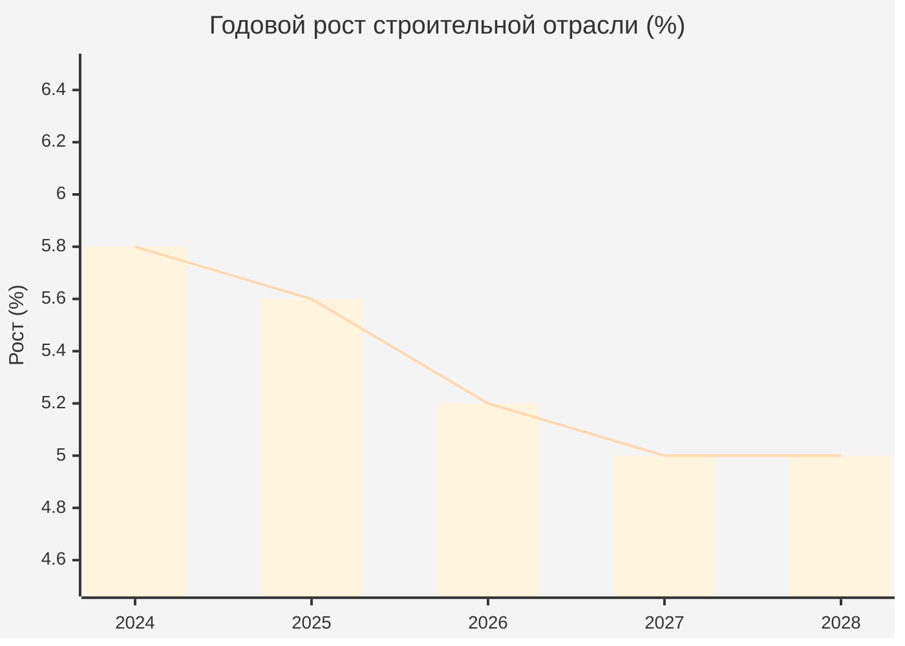
```mermaid
%%{init: {'theme': 'base', 'themeVariables': { 'primaryColor': '#FF9800'}}}%%
xychart-beta
    title "Годовой рост строительной отрасли (%)"
    x-axis [2024, 2025, 2026, 2027, 2028]
    y-axis "Рост (%)" 4.5 --> 6.5
    bar [5.8, 5.6, 5.2, 5.0, 5.0]
    line [5.8, 5.6, 5.2, 5.0, 5.0]
```

> **Средний рост 2024-2028: ~5% ежегодно**

---

### 7. Объемы строительных работ по годам

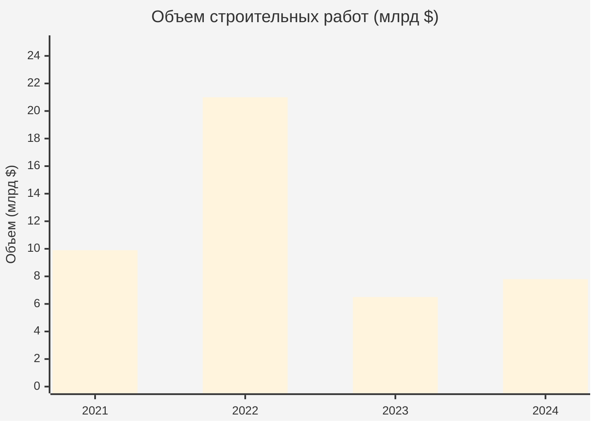
```mermaid
%%{init: {'theme': 'base', 'themeVariables': { 'primaryColor': '#9C27B0'}}}%%
xychart-beta
    title "Объем строительных работ (млрд $)"
    x-axis [2021, 2022, 2023, 2024]
    y-axis "Объем (млрд $)" 0 --> 25
    bar [9.9, 21, 6.5, 7.8]
```

> **Q1 2025: 50,3 трлн сумов** с темпом роста 10,8%

---

### 8. Показатели цементного рынка (2024)

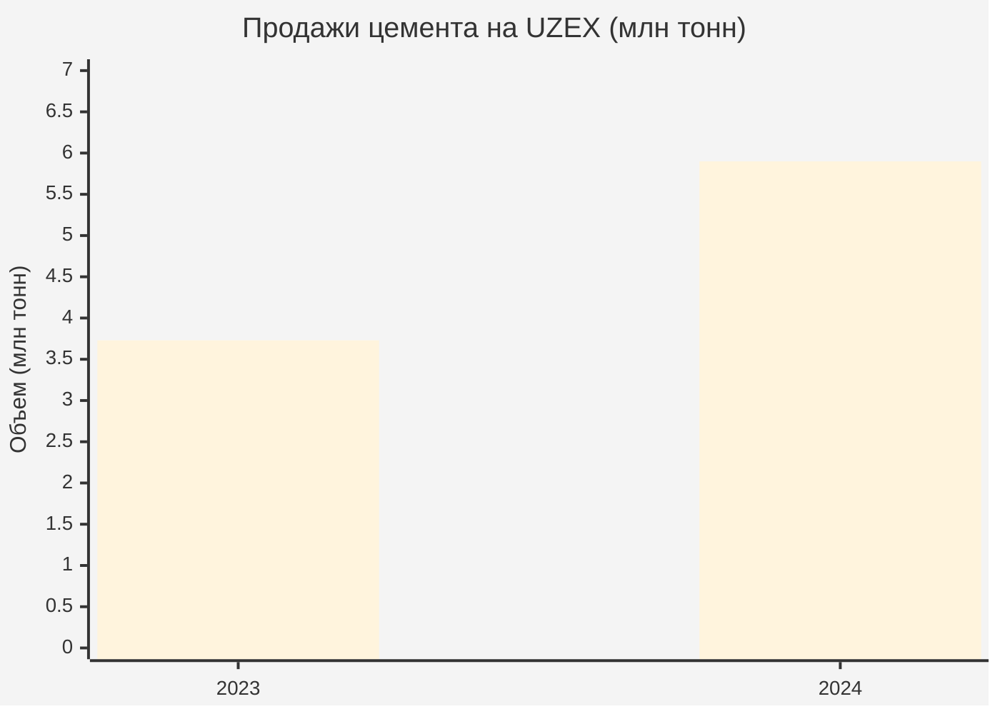
```mermaid
%%{init: {'theme': 'base'}}%%
xychart-beta
    title "Продажи цемента на UZEX (млн тонн)"
    x-axis ["2023", "2024"]
    y-axis "Объем (млн тонн)" 0 --> 7
    bar [3.73, 5.9]
```

> **Рост цементного рынка: +58%** в 2024 году

---

### 9. Жилищное строительство (млн кв.м и тыс. квартир)

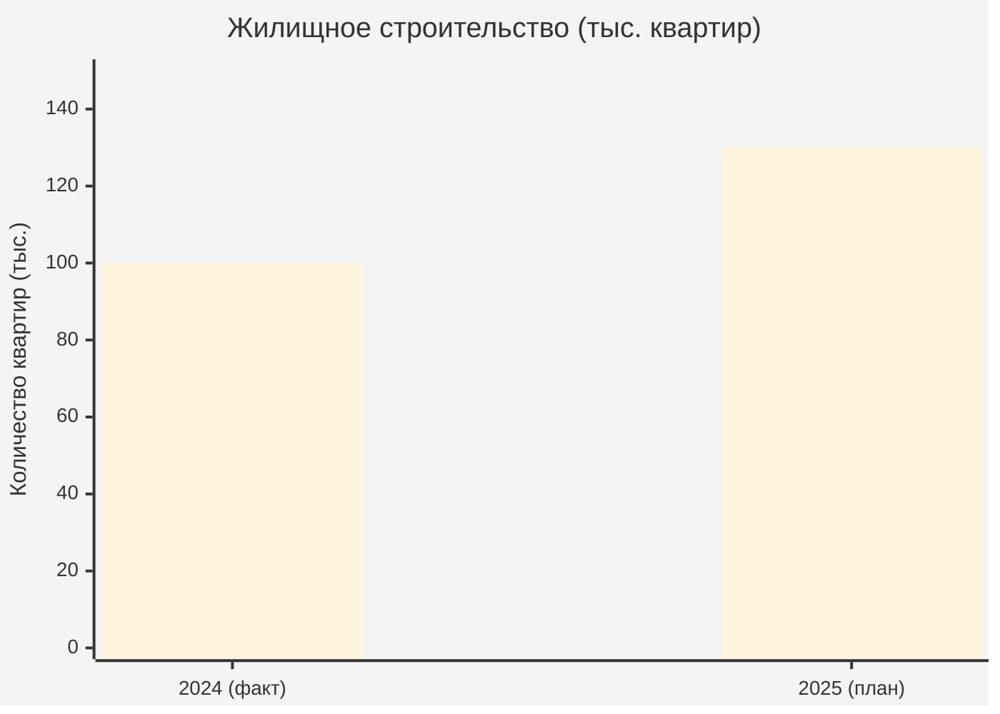
```mermaid
%%{init: {'theme': 'base', 'themeVariables': { 'primaryColor': '#E91E63'}}}%%
xychart-beta
    title "Жилищное строительство (тыс. квартир)"
    x-axis ["2024 (факт)", "2025 (план)"]
    y-axis "Количество квартир (тыс.)" 0 --> 150
    bar [100, 130]
```

> **2024:** 14,8 млн кв.м жилья (100 тыс. квартир) | **План 2025:** 130 тыс. квартир (+30%)

---

### 10. ВВП на душу населения ($)

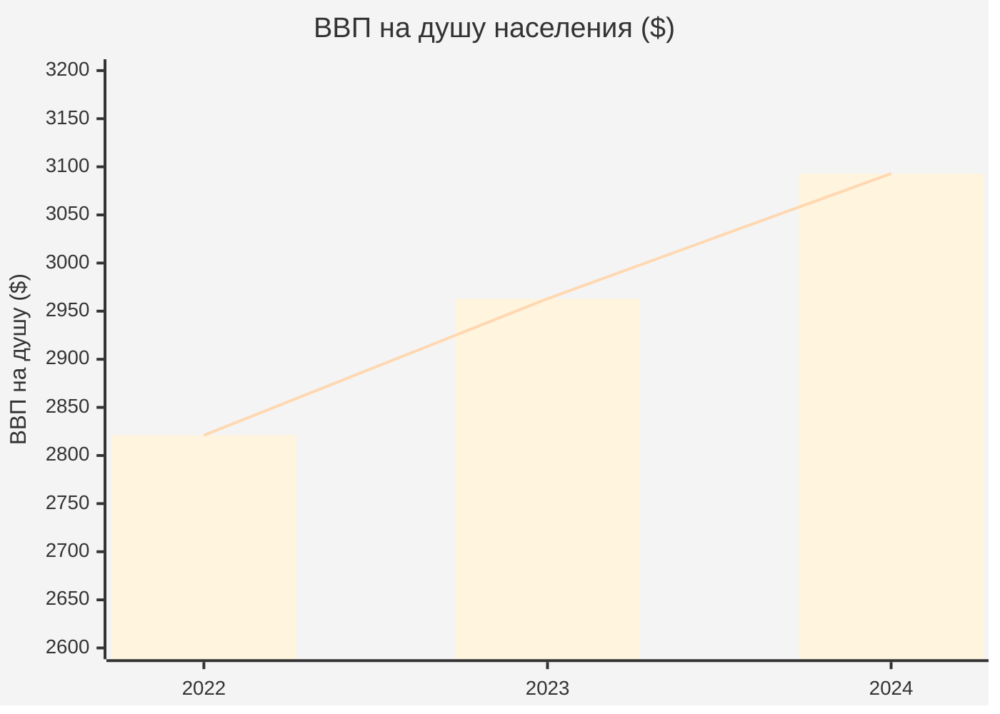
```mermaid
%%{init: {'theme': 'base', 'themeVariables': { 'primaryColor': '#00BCD4'}}}%%
xychart-beta
    title "ВВП на душу населения ($)"
    x-axis [2022, 2023, 2024]
    y-axis "ВВП на душу ($)" 2600 --> 3200
    bar [2821, 2963, 3093]
    line [2821, 2963, 3093]
```

> **Рост в 2024: +4,4%** | ВВП на душу населения достиг $3 092,7

---

### 11. Снижение уровня бедности

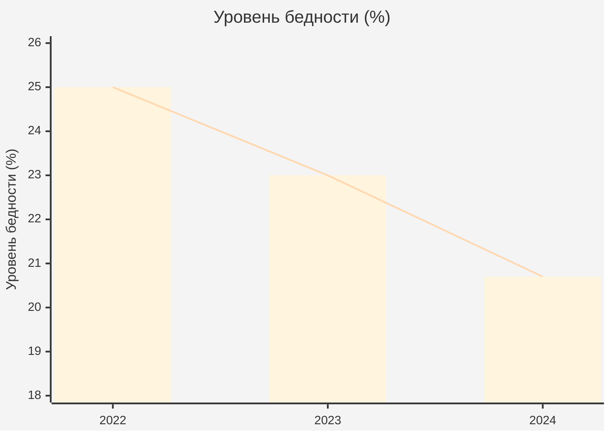
```mermaid
%%{init: {'theme': 'base', 'themeVariables': { 'primaryColor': '#4CAF50'}}}%%
xychart-beta
    title "Уровень бедности (%)"
    x-axis [2022, 2023, 2024]
    y-axis "Уровень бедности (%)" 18 --> 26
    bar [25, 23, 20.7]
    line [25, 23, 20.7]
```

> Уровень бедности снизился до **20,7%** в 2024 году

---

### 12. Государственные инвестиции в 2024 году (млрд $)

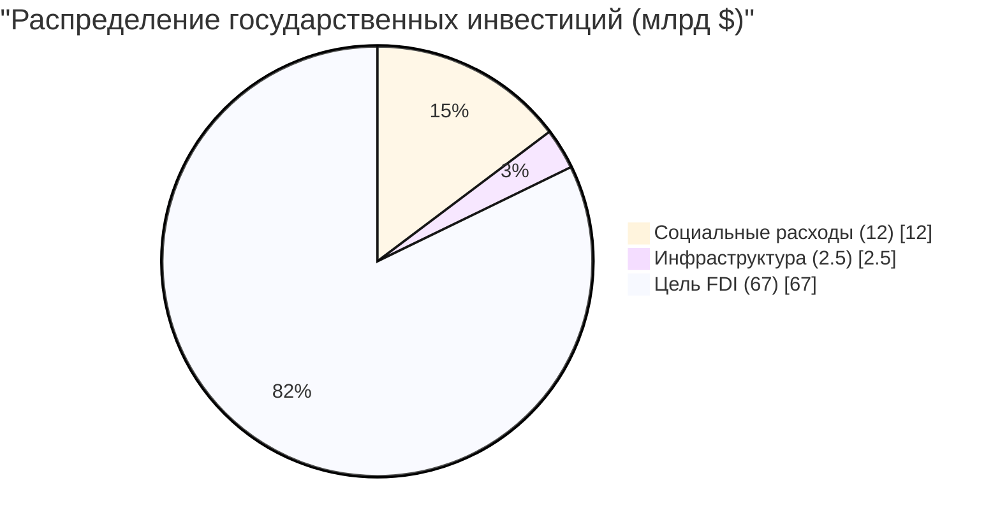
```mermaid
%%{init: {'theme': 'base'}}%%
pie showData
    title "Распределение государственных инвестиций (млрд $)"
    "Социальные расходы (12)" : 12
    "Инфраструктура (2.5)" : 2.5
    "Цель FDI (67)" : 67
```

> **Бюджет 2024:** $12 млрд на социальные расходы, $2,5 млрд на инфраструктуру

---

### 13. Ведущие регионы по стоимости проектов (2024)

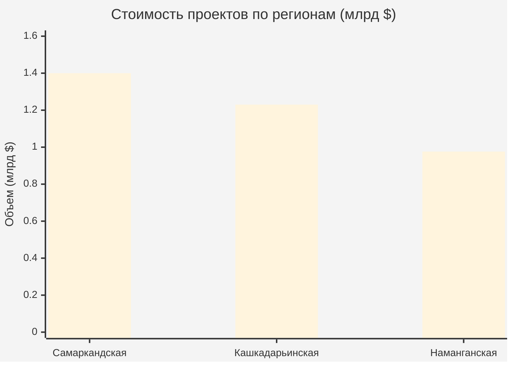
```mermaid
%%{init: {'theme': 'base', 'themeVariables': { 'primaryColor': '#673AB7'}}}%%
xychart-beta
    title "Стоимость проектов по регионам (млрд $)"
    x-axis ["Самаркандская", "Кашкадарьинская", "Наманганская"]
    y-axis "Объем (млрд $)" 0 --> 1.6
    bar [1.4, 1.23, 0.976]
```

> **Топ-3 региона:** Самарканд ($1,4 млрд), Кашкадарья ($1,23 млрд), Наманган ($976 млн)

---

### 14. Экспорт строительных материалов (Q1 2024, млн $)

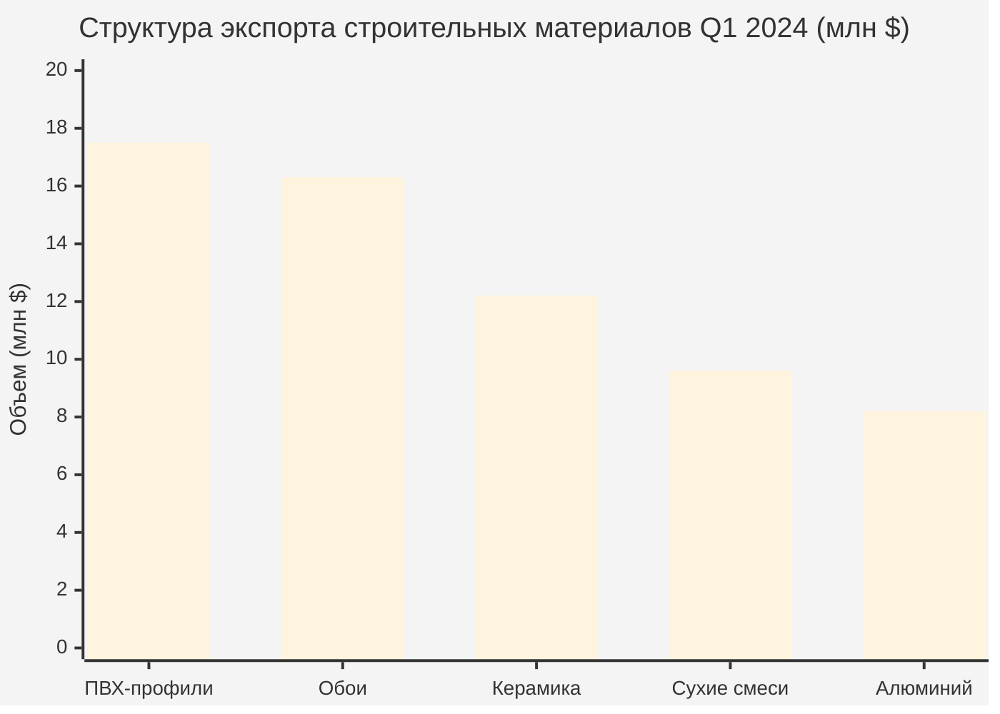
```mermaid
%%{init: {'theme': 'base', 'themeVariables': { 'primaryColor': '#FF5722'}}}%%
xychart-beta
    title "Структура экспорта строительных материалов Q1 2024 (млн $)"
    x-axis ["ПВХ-профили", "Обои", "Керамика", "Сухие смеси", "Алюминий"]
    y-axis "Объем (млн $)" 0 --> 20
    bar [17.5, 16.3, 12.2, 9.6, 8.2]
```

> **Общий экспорт Q1 2024:** $152,9 млн | **План на год:** $1,1 млрд

---

### 15. Структура импорта промышленных товаров (2024, млрд $)

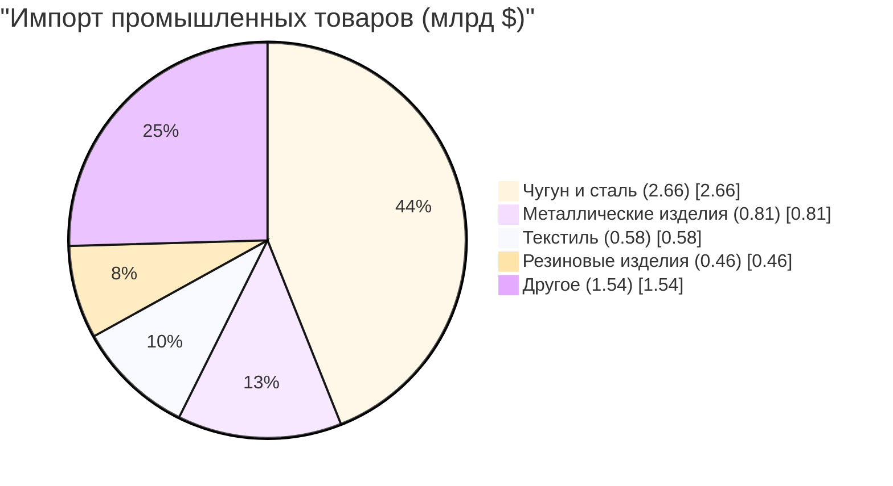
```mermaid
%%{init: {'theme': 'base'}}%%
pie showData
    title "Импорт промышленных товаров (млрд $)"
    "Чугун и сталь (2.66)" : 2.66
    "Металлические изделия (0.81)" : 0.81
    "Текстиль (0.58)" : 0.58
    "Резиновые изделия (0.46)" : 0.46
    "Другое (1.54)" : 1.54
```

> **Общий импорт промышленных товаров:** $6,05 млрд (снижение на 4,2%)

---

### 16. Производство строительных материалов (трлн сумов)

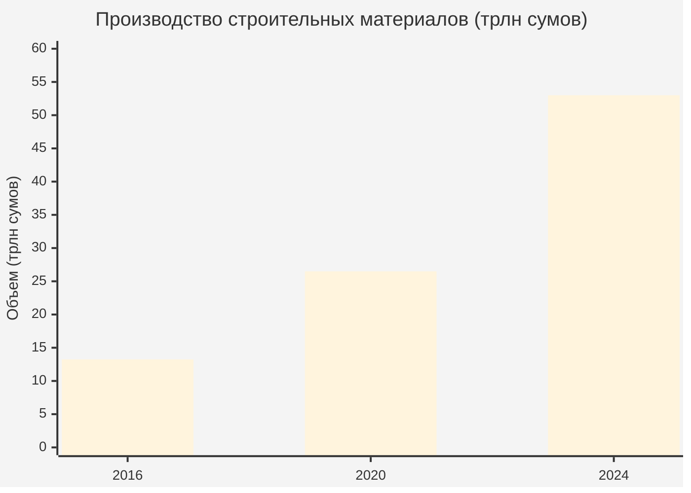
```mermaid
%%{init: {'theme': 'base', 'themeVariables': { 'primaryColor': '#795548'}}}%%
xychart-beta
    title "Производство строительных материалов (трлн сумов)"
    x-axis [2016, 2020, 2024]
    y-axis "Объем (трлн сумов)" 0 --> 60
    bar [13.25, 26.5, 53]
```

> Индустрия строительных материалов выросла в **4 раза** за 8 лет

---

### 17. Стратегические инвестиции (2024-2025)

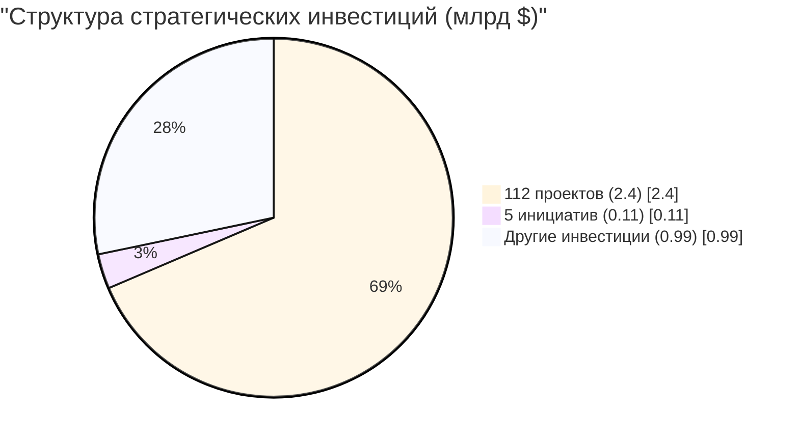
```mermaid
%%{init: {'theme': 'base'}}%%
pie showData
    title "Структура стратегических инвестиций (млрд $)"
    "112 проектов (2.4)" : 2.4
    "5 инициатив (0.11)" : 0.11
    "Другие инвестиции (0.99)" : 0.99
```

> **Общий инвестиционный портфель:** $3,5 млрд

---

### 18. Количество компаний по отраслям (2024-2025)

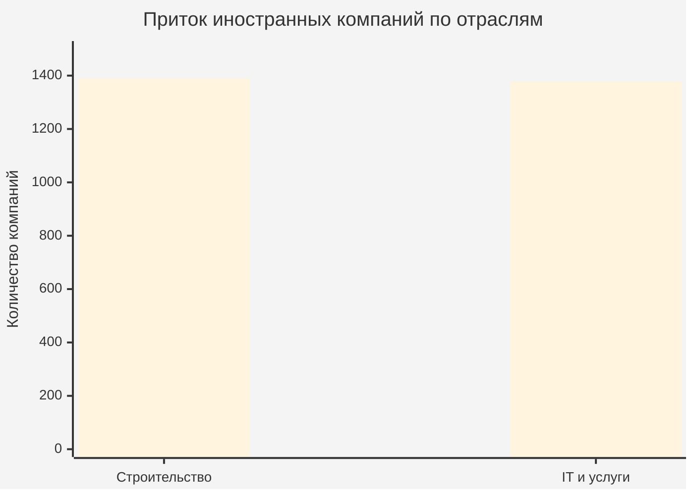
```mermaid
%%{init: {'theme': 'base', 'themeVariables': { 'primaryColor': '#3F51B5'}}}%%
xychart-beta
    title "Приток иностранных компаний по отраслям"
    x-axis ["Строительство", "IT и услуги"]
    y-axis "Количество компаний" 0 --> 1500
    bar [1389, 1377]
```

> **Строительство:** 1 389 компаний | **IT-сектор:** 1 377 компаний

---

### 19. Внешнеторговый оборот Узбекистана (2024)

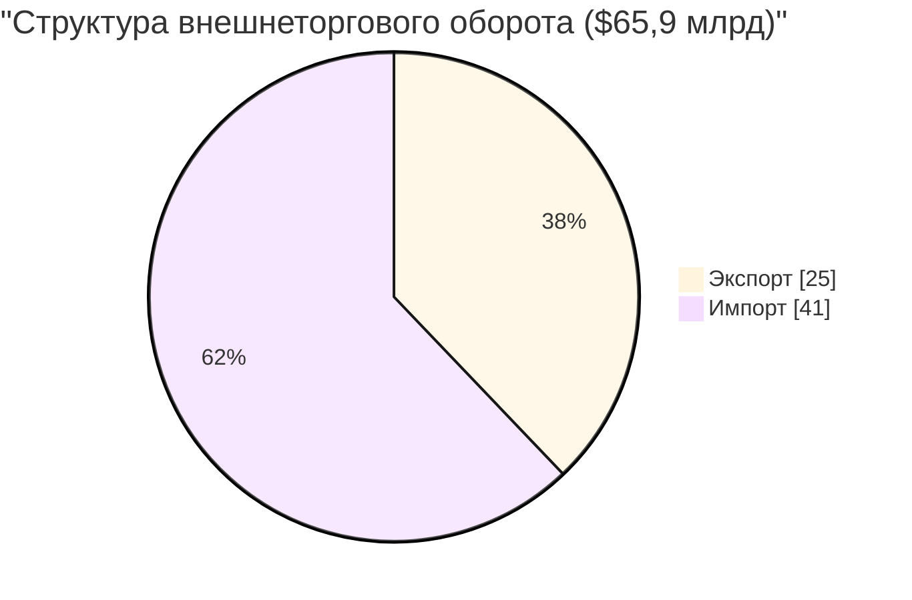
```mermaid
%%{init: {'theme': 'base'}}%%
pie showData
    title "Структура внешнеторгового оборота ($65,9 млрд)"
    "Экспорт" : 25
    "Импорт" : 41
```

> **Общий внешнеторговый оборот:** $65,9 млрд

---

### 20. Сравнительный анализ: рост секторов экономики (2024)

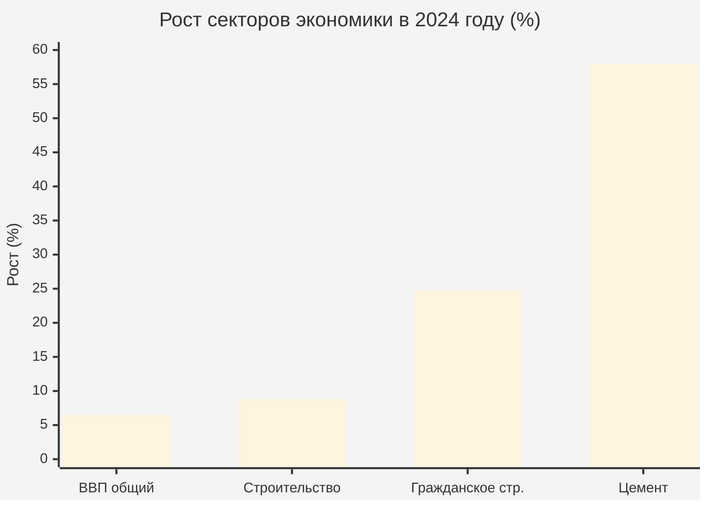
```mermaid
%%{init: {'theme': 'base', 'themeVariables': { 'primaryColor': '#009688'}}}%%
xychart-beta
    title "Рост секторов экономики в 2024 году (%)"
    x-axis ["ВВП общий", "Строительство", "Гражданское стр.", "Цемент"]
    y-axis "Рост (%)" 0 --> 60
    bar [6.5, 8.8, 24.7, 58]
```

> **Лидер роста:** цементный рынок (+58%) | Гражданское строительство (+24,7%)

---

### Сводная таблица ключевых показателей

| Показатель | 2024 | 2025 (прогноз) | Изменение |
|------------|------|----------------|-----------|
| Объем рынка стройматериалов | $4,42 млрд | $4,55 млрд | +2,86% |
| FDI | $11,9 млрд | $43 млрд (цель) | +261,3% |
| Рост строительной отрасли | 5,8% | 5,6% | -0,2 п.п. |
| ВВП на душу населения | $3 093 | ~$3 230 | +4,4% |
| Уровень бедности | 20,7% | ~19% | -1,7 п.п. |
| Жилищное строительство | 100 тыс. кв. | 130 тыс. кв. | +30% |
| Экспорт стройматериалов | $1,1 млрд | ~$1,3 млрд | +18% |
| Цементный рынок (UZEX) | 5,9 млн т | ~6,5 млн т | +10% |

---

## Обзор рынка

Рынок строительных инструментов в Узбекистане в 2024-2025 годах демонстрирует устойчивый рост, обусловленный активным развитием строительной отрасли страны. Строительный сектор генерирует приблизительно **6% валового внутреннего продукта** Узбекистана и продолжает стабильно расти.

### Ключевые показатели строительной отрасли:
- **Занятость**: около 1,5 миллиона строительных рабочих
- **Количество предприятий**: по состоянию на 1 июня 2021 года в строительном секторе насчитывается 43 300 предприятий и организаций
- **Рейтинг строительных организаций**: включено свыше 36 000 строительных организаций

---

## Статистика и объемы рынка

### Рынок строительных материалов и инструментов (2024)

**Общий объем рынка строительных материалов и инструментов:**
- Выручка рынка строительных материалов и инструментов в Узбекистане в 2024 году составила **$4,42 млрд**
- Ожидаемый ежегодный рост: **2,86% (CAGR 2024-2029)**

**Производство строительных материалов:**
- Индустрия строительных материалов выросла в **четыре раза** за последние восемь лет
- В 2024 году объем производства достиг **53 триллиона сумов ($4,37 млрд)**
- Экспорт строительных материалов: **$1,1 млрд**

**Рост строительной отрасли:**
- В 2024 году строительная отрасль выросла на **5,8% в реальном выражении**
- Прогноз на 2025 год: рост на **5,6% в реальном выражении**
- Средний ежегодный рост с 2024 по 2028 год: **5%**
- Строительный сектор вырос на **8,8%**, достигнув 96 801,9 млрд сумов
- Проекты гражданского строительства показали рост **24,7%**

**Объемы строительных работ:**
- 2021 год: $9,9 млрд
- 2022 год: $21 млрд
- 2023 год: 80 триллионов сумов
- Первый квартал 2025 года: 50,3 трлн сумов с темпом роста **10,8%**

**Цементный рынок:**
- В 2024 году цементный рынок Узбекистана показал **рост на 58% в годовом выражении**
- Продажи на Узбекской товарной бирже (UZEX) достигли **5,9 млн тонн**

**Жилищное строительство:**
- За 2024 год введено в эксплуатацию **14,8 млн кв. м жилья**
- Построено многоэтажных домов более чем на **100 тыс. квартир**
- План на 2025 год: **130 тыс. квартир**

**Производство (январь-февраль 2024):**
- Продукция стройматериалов на сумму **3,4 триллиона сумов**
- Рост по сравнению с аналогичным периодом прошлого года: **8,2%**

### Онлайн-рынок строительных инструментов

- Платформа **Prom.uz** предлагает **7 378 предложений** по продаже строительных материалов
- Цены на строительные инструменты начинаются от **406 000 сумов**
- Функционируют специализированные онлайн-платформы: **Stab.uz**, **Stroyka.uz**, **OLX.uz**, **BestTools.uz**

---

## Тенденции развития

### 1. Рост прямых иностранных инвестиций (FDI)

**2024 год:**
- Приток прямых иностранных инвестиций вырос на **53,6%**, достигнув 156,8 трлн сумов (**$11,9 млрд**)
- Отношение FDI к ВВП увеличилось с **6% до 12%**
- В первой половине 2024 года привлечено 66,8 трлн сумов (**$5,3 млрд**)

**План на 2025 год:**
- Цель по увеличению FDI до 566,7 трлн сумов (**$43 млрд**)
- Это эквивалентно росту на **261,3% в годовом выражении**

### 2. Доминирование импортной продукции

Несмотря на растущий спрос на строительные материалы и инструменты в Узбекистане, местный рынок все еще **доминирован импортными товарами**. Даже при наличии значительных отечественных производителей ПВХ-труб, фитингов, облицовочного камня и строительного стекла, в 2024 году продолжался значительный импорт этих продуктов.

### 3. Государственные инвестиции

**Бюджет 2024 года:**
- **151,5 триллиона сумов ($12 млрд)** выделено на социальные расходы
- **31,7 миллиарда ($2,5 млрд)** на развитие инфраструктуры
- Цель привлечения **844,3 триллиона сумов ($67 млрд)** иностранных инвестиций

### 4. Отмена таможенных пошлин

В целях снижения стоимости строительства до 2025 года отменяется таможенная пошлина на ввоз:
- Древесины
- Фанеры
- Деревянной опалубки
- Стекла

### 5. Стратегическое развитие

**Долгосрочная стратегия развития:**
- **112 проектов** на сумму **$2,4 миллиарда**
- **5 стратегических инициатив** на сумму **$110 миллионов**
- Общий инвестиционный портфель: **$3,5 миллиарда**

Утверждены стратегия и «дорожная карта» модернизации и инновационного развития строительной отрасли на 2021-2025 годы.

### 6. Инфраструктурные проекты

Рост обусловлен инвестициями в:
- Транспортные проекты
- Проекты возобновляемой энергетики
- Коммерческое строительство
- Недвижимость и инфраструктуру

**Ведущие регионы по стоимости проектов в 2024 году:**
1. Самаркандская область: **$1,4 миллиарда**
2. Кашкадарьинская область: **$1,23 миллиарда**
3. Наманганская область: **$976 миллионов**

---

## Покупательская способность

### Экономические показатели (2024)

**ВВП:**
- ВВП Узбекистана по текущим ценам составил **1 454 573,9 миллиарда сумов**
- Рост в реальном выражении: **6,5%** по сравнению с 2023 годом

**ВВП на душу населения:**
- **39 131,4 тысячи сумов ($3 092,7)**
- Рост в реальном выражении: **4,4%** по сравнению с 2023 годом

**Снижение бедности:**
- Уровень бедности снизился до **20,7%** в 2024 году
- Поддерживается ростом зарплат и доходов домохозяйств

### Факторы роста покупательской способности

1. **Рост доходов населения**: улучшение экономических показателей способствует увеличению доходов
2. **Снижение бедности**: с 2023 года наблюдается устойчивая тенденция к снижению уровня бедности
3. **Развитие строительной отрасли**: создает рабочие места и повышает уровень жизни
4. **Государственная поддержка**: социальные программы и субсидии

### Покупательское поведение

- **Растущий спрос на качественные инструменты**: с ростом доходов потребители склонны выбирать более качественную продукцию
- **Предпочтение известных брендов**: доверие к зарекомендовавшим себя маркам (особенно китайским, российским, турецким, немецким)
- **Онлайн-покупки**: активный рост электронной коммерции в сегменте строительных материалов
- **Профессиональный сегмент**: строительные компании и подрядчики составляют значительную долю покупателей

---

## Конкурентная среда

### Структура рынка

Рынок строительных инструментов и оборудования в Узбекистане характеризуется **сильным присутствием иностранных компаний**, которые составляют **75% рынка**.

### Иностранные участники рынка

**Распределение по странам:**
1. **Китай**: 132 компании (лидер рынка)
2. **Россия**: 52 компании
3. **Турция**: 30 компаний
4. **Германия**: 19 компаний
5. **Великобритания**: 15 компаний
6. **Казахстан**: 10 компаний

### Узбекские производители

Узбекские компании составляют **четверть от общего числа участников рынка**. Среди крупных отечественных производителей и экспортеров:

1. **Uzmetkombinat** - металлургическое производство
2. **Akfa Building Materials (Ytong)** - строительные материалы
3. **Techno Commerce** - торговая компания
4. **Toshkent Metallurgiya Zavodi** - Ташкентский металлургический завод
5. **Arton** - производство и торговля

### Крупнейшие строительные компании-потребители

**Ведущие застройщики и строительные компании:**
1. **Murad Buildings** - на рынке 18 лет, 12 проектов, 1 100 проданных квартир
2. **Dream City Development** - девелопер объектов недвижимости высокого класса
3. **O'zbegim development** - один из ведущих застройщиков
4. **Golden House** - более 14 лет на рынке, лидирующие позиции
5. **Grand Capital** - работает с 2016 года, 8 проектов

### Торговая инфраструктура

**ARK BULOQ** - международный торговый центр, специализирующийся на строительных материалах и инструментах:
- Общая площадь торгового центра: **10,5 гектаров**
- Демонстрирует масштаб инфраструктуры рынка строительных материалов

### Рыночные сегменты

Рынок включает следующие категории:
- Строительное оборудование и инструменты
- Лифты и подъемное оборудование
- Строительные материалы
- Опалубка и леса
- Металлические изделия
- Камень и керамика
- Строительные химикаты
- Электрические и кабельные изделия

### Конкурентные преимущества

**Иностранные компании:**
- Узнаваемость брендов
- Качество продукции
- Инновационные технологии
- Развитая сеть дистрибуции

**Местные производители:**
- Ценовая доступность
- Знание локального рынка
- Быстрая логистика
- Государственная поддержка

---

## Анализ импорта и экспорта

### Экспорт строительных материалов (2024)

**Общий объем:**
- Планируемый экспорт строительных материалов: **$1,1 миллиарда** в 2024 году
- Первый квартал 2024 года: **$152,9 миллиона**

**Основные экспортные товары (Q1 2024):**
1. **ПВХ-профили и трубы**: $17,5 млн
2. **Алюминиевые профили**: $8,2 млн
3. **Керамическая плитка и изделия**: $12,2 млн
4. **Сухие строительные и цементные смеси**: $9,6 млн
5. **Обои**: $16,3 млн

**Направления экспорта:**
- Азербайджан
- Турция
- Канада
- Румыния
- Казахстан
- Кыргызстан
- Туркменистан
- Таджикистан

### Импорт промышленных товаров (2024)

**Общий объем (январь-декабрь 2024):**
- Импорт промышленных товаров: **$6,05 миллиарда**
- Снижение на **4,2%** по сравнению с 2023 годом
- Доля в общем импорте: **15,5%**

**Основные импортные товары:**
1. **Чугун и сталь**: $2,66 млрд
2. **Металлические изделия**: $814,7 млн
3. **Текстильная пряжа, ткани и готовые изделия**: $582,1 млн
4. **Резиновые изделия**: $457,9 млн

### Внешнеторговый оборот

**2024 год:**
- Общий внешнеторговый оборот Узбекистана достиг **$65,9 миллиарда**

### Тенденции импорта-экспорта

1. **Рост экспорта**: Узбекистан активно развивает экспорт строительных материалов в соседние страны
2. **Импортозависимость**: несмотря на развитие местного производства, сохраняется зависимость от импорта качественных инструментов и оборудования
3. **Диверсификация**: расширение географии экспортных поставок
4. **Импортозамещение**: постепенное замещение импортных товаров местными аналогами в некоторых категориях

---

## Анализ новостей и событий

### Ключевые события 2024-2025 годов

#### 1. Масштабные иностранные инвестиции

**Knauf** - один из крупнейших инвесторов в строительной отрасли Узбекистана:
- Продолжает развивать технологические решения
- СП «БУХАРАГИПС» (производитель сухих смесей) инвестировал **16 млн евро** с 2025 года

**Китайские инвестиции:**
- Китай обеспечил **половину притока новых иностранных компаний** в Узбекистан за 2025 год
- Строительная отрасль привлекла **1 389 компаний**

#### 2. Выставки и конференции

**UzBuild Tashkent 2025**:
- 26-я Международная выставка «Строительство»
- Конференция ICCI (International Construction Conference & Innovation)
- Демонстрация новейших технологий и инструментов
- Площадка для деловых контактов

#### 3. Рост IT-сектора в строительстве

- Сфера информационных технологий и IT-услуг привлекла **1 377 компаний**
- Внедрение цифровых решений в строительстве и торговле инструментами
- Развитие онлайн-платформ для продажи строительных материалов

#### 4. Региональное развитие

**Активное строительство в регионах:**
- Самаркандская область: проекты на $1,4 млрд
- Кашкадарьинская область: проекты на $1,23 млрд
- Наманганская область: проекты на $976 млн

#### 5. Модернизация отрасли

- Утверждена стратегия модернизации строительной отрасли на 2021-2025 годы
- Внедрение инновационных технологий
- Повышение энергоэффективности строительства
- Развитие производства экологичных материалов

#### 6. Тенденции укрупнения

- Концентрация рынка: крупные игроки усиливают позиции
- Слияния и поглощения в строительном секторе
- Формирование вертикально интегрированных компаний

#### 7. Онлайн-рейтинг строительных компаний

- Запущен электронный рейтинг строительных подрядных организаций
- Повышение прозрачности рынка
- Улучшение качества строительных работ

---

## Стратегии продаж

### 1. Сегментация целевой аудитории

#### Профессиональный сегмент (B2B)
**Характеристики:**
- Строительные компании и подрядчики
- Промышленные предприятия
- Государственные организации

**Стратегия:**
- Прямые продажи через менеджеров по работе с ключевыми клиентами
- Тендерное участие
- Долгосрочные контракты с дисконтной системой
- Техническая поддержка и консультации
- Гарантийное и постгарантийное обслуживание
- Поставки оптовых партий с отсрочкой платежа

#### Розничный сегмент (B2C)
**Характеристики:**
- Индивидуальные застройщики
- Домашние мастера
- Мелкие ремонтные работы

**Стратегия:**
- Розничные магазины в крупных городах
- Онлайн-продажи через маркетплейсы (Prom.uz, OLX.uz)
- Демонстрационные образцы и зоны
- Программы лояльности
- Сезонные акции и скидки
- Консультации продавцов

### 2. Ценовые стратегии

#### Конкурентное ценообразование
- Мониторинг цен конкурентов (особенно китайских и российских брендов)
- Позиционирование в среднем или чуть ниже среднего ценовом сегменте
- Специальные предложения для оптовых покупателей

#### Дифференцированное ценообразование
- Премиум-бренды (немецкие, японские): высокий ценовой сегмент
- Средний сегмент: турецкие, российские бренды
- Бюджетный сегмент: китайские производители

#### Гибкая система скидок
- Скидки на объем (5-15% в зависимости от партии)
- Сезонные распродажи (до 30% в низкий сезон)
- Бонусные программы для постоянных клиентов

### 3. Каналы дистрибуции

#### Прямые каналы
- Собственные фирменные магазины
- Региональные представительства
- Прямые продажи крупным подрядчикам

#### Непрямые каналы
- Сеть дилеров и дистрибьюторов
- Строительные гипермаркеты
- Специализированные торговые центры (например, ARK BULOQ)
- Онлайн-маркетплейсы

#### Омниканальный подход
- Интеграция онлайн и офлайн продаж
- Возможность заказа онлайн с получением в магазине
- Единая система учета и лояльности

### 4. Маркетинговые стратегии

#### Продвижение бренда
- Участие в выставках (UzBuild, отраслевые мероприятия)
- Спонсорство крупных строительных проектов
- Партнерство с профессиональными ассоциациями
- Демонстрация кейсов успешных проектов

#### Цифровой маркетинг
- SEO-оптимизация сайтов для локального поиска
- Контекстная реклама (Google Ads, Yandex Direct)
- SMM в популярных социальных сетях (Telegram, Instagram)
- Email-маркетинг для B2B клиентов

#### Контент-маркетинг
- Обучающие видео по использованию инструментов
- Технические статьи и инструкции
- Вебинары для профессионалов
- Блог с советами и лайфхаками

### 5. Работа с профессиональным сообществом

#### Обучение и сертификация
- Тренинги для строителей по использованию инструментов
- Сертификационные программы
- Демонстрационные мероприятия
- Технические семинары

#### Партнерские программы
- Программы для строительных компаний
- Специальные условия для крупных подрядчиков
- Техническая поддержка на объектах

### 6. Работа с регионами

#### Региональная экспансия
- Открытие представительств в крупных городах
- Работа с местными дилерами
- Адаптация ассортимента под региональные особенности
- Локальные маркетинговые кампании

#### Приоритетные регионы (по объему строительства)
1. Самаркандская область
2. Кашкадарьинская область
3. Наманганская область
4. Ташкент и Ташкентская область

### 7. Сервисная стратегия

#### Послепродажное обслуживание
- Гарантийный ремонт и замена
- Сервисные центры в крупных городах
- Горячая линия технической поддержки
- Обучение правильной эксплуатации

#### Дополнительные услуги
- Доставка на объект
- Монтаж и настройка оборудования
- Аренда инструментов (для разового использования)
- Trade-in программы (обмен старого инструмента)

### 8. Управление запасами

#### Оптимизация ассортимента
- Анализ ABC/XYZ для определения ключевых позиций
- Быстрая ротация популярных товаров
- Минимизация складских издержек

#### Логистика
- Централизованный склад в Ташкенте
- Региональные распределительные центры
- Оптимизация цепочки поставок
- Партнерство с логистическими компаниями

### 9. Работа с импортом

#### Прямые закупки
- Прямые контракты с производителями
- Минимизация количества посредников
- Оптовые закупки для снижения себестоимости

#### Таможенное оформление
- Использование преимуществ отмены таможенных пошлин на некоторые категории
- Оптимизация таможенных процедур
- Работа с таможенными брокерами

### 10. Адаптация к локальному рынку

#### Учет особенностей рынка
- Доминирование китайских товаров: конкуренция по цене
- Растущий спрос на качество: дифференциация через премиум-сегмент
- Высокая роль личных отношений в B2B: персональный подход

#### Локализация
- Инструкции на узбекском и русском языках
- Адаптация упаковки под локальные предпочтения
- Учет климатических особенностей региона

---

## Выводы и рекомендации

### Ключевые выводы

1. **Растущий рынок**: Рынок строительных инструментов в Узбекистане демонстрирует стабильный рост, обусловленный развитием строительной отрасли (рост на 5,8% в 2024 году, прогноз 5,6% на 2025 год).

2. **Высокий потенциал**: Объем рынка строительных материалов и инструментов составляет $4,42 млрд с ожидаемым ежегодным ростом 2,86% до 2029 года.

3. **Иностранное доминирование**: 75% рынка контролируется иностранными компаниями, преимущественно из Китая (132 компании), России (52), Турции (30) и Германии (19).

4. **Импортозависимость**: Несмотря на развитие местного производства, рынок остается зависимым от импорта качественных инструментов и оборудования.

5. **Рост FDI**: Приток прямых иностранных инвестиций вырос на 53,6% в 2024 году, достигнув $11,9 млрд, с амбициозной целью $43 млрд на 2025 год.

6. **Улучшение покупательской способности**: ВВП на душу населения вырос на 4,4% до $3 092,7, уровень бедности снизился до 20,7%.

7. **Государственная поддержка**: Правительство активно поддерживает строительную отрасль через инвестиции ($2,5 млрд в инфраструктуру), отмену таможенных пошлин и стратегические программы.

8. **Региональное развитие**: Активное строительство в регионах создает спрос на инструменты за пределами столицы (Самаркандская область - $1,4 млрд проектов, Кашкадарьинская - $1,23 млрд).

9. **Цифровизация**: Растущая роль онлайн-продаж и электронных платформ (Prom.uz, Stab.uz, OLX.uz).

10. **Профессионализация**: Растущие требования к качеству инструментов со стороны крупных строительных компаний и подрядчиков.

### Рекомендации для участников рынка

#### Для импортеров и дистрибьюторов

1. **Диверсификация портфеля**:
   - Предлагать инструменты разных ценовых сегментов (премиум, средний, бюджетный)
   - Балансировать между китайскими (цена) и европейскими (качество) брендами

2. **Региональная экспансия**:
   - Открывать представительства в быстрорастущих регионах (Самарканд, Кашкадарья, Наманган)
   - Работать с местными дилерами для проникновения на локальные рынки

3. **Омниканальность**:
   - Развивать онлайн-продажи параллельно с традиционной розницей
   - Интегрировать онлайн и офлайн каналы

4. **Работа с B2B**:
   - Устанавливать прямые отношения с крупными строительными компаниями
   - Предлагать специальные условия для корпоративных клиентов
   - Участвовать в тендерах на поставку инструментов для государственных проектов

5. **Использование льгот**:
   - Оптимизировать импорт, используя отмену таможенных пошлин на определенные категории
   - Изучать возможности государственной поддержки

#### Для производителей инструментов

1. **Локализация производства**:
   - Рассмотреть возможность открытия производства в Узбекистане
   - Использовать преимущества растущего рынка и государственной поддержки

2. **Партнерства**:
   - Создавать совместные предприятия с местными компаниями
   - Использовать опыт успешных примеров (Knauf, БУХАРАГИПС)

3. **Адаптация продукции**:
   - Учитывать климатические особенности региона
   - Создавать инструкции на узбекском и русском языках
   - Предлагать технические решения для местных условий эксплуатации

#### Для розничных продавцов

1. **Специализация**:
   - Фокус на определенных категориях инструментов (электроинструменты, ручной инструмент, измерительные приборы)
   - Создание экспертизы в выбранной нише

2. **Сервис**:
   - Предлагать консультации и обучение клиентов
   - Организовывать демонстрационные зоны
   - Обеспечивать послепродажное обслуживание

3. **Лояльность**:
   - Внедрять программы лояльности для постоянных клиентов
   - Создавать сообщества профессионалов
   - Организовывать мастер-классы и обучающие мероприятия

#### Общие рекомендации

1. **Мониторинг трендов**:
   - Следить за развитием строительной отрасли и крупными проектами
   - Анализировать изменения в законодательстве и государственных программах
   - Отслеживать технологические инновации в производстве инструментов

2. **Качество превыше всего**:
   - С ростом покупательской способности растет спрос на качественные инструменты
   - Инвестировать в проверенные бренды и сертифицированную продукцию

3. **Цифровая трансформация**:
   - Развивать онлайн-присутствие
   - Использовать цифровой маркетинг
   - Внедрять CRM-системы для управления клиентами

4. **Устойчивое развитие**:
   - Предлагать экологичные и энергоэффективные инструменты
   - Следовать международным стандартам качества и безопасности

5. **Образование рынка**:
   - Инвестировать в обучение клиентов правильному использованию инструментов
   - Повышать общий уровень профессионализма в отрасли

### Перспективы рынка на 2025-2028 годы

**Позитивные факторы:**
- Прогнозируемый ежегодный рост строительной отрасли на 5-5,6%
- Масштабные государственные и частные инвестиции в инфраструктуру
- Рост FDI и приток международных компаний
- Улучшение покупательской способности населения
- Жилищное строительство (130 тыс. квартир в 2025 году)
- Развитие транспортных и энергетических проектов

**Вызовы:**
- Высокая конкуренция со стороны китайских производителей
- Зависимость от импорта
- Необходимость адаптации к локальным условиям
- Колебания валютных курсов

**Ожидаемый рост рынка:**
- Рынок строительных материалов и инструментов: CAGR 2,86% (2024-2029)
- Общий объем к 2029 году: приблизительно $5,1 млрд

---

## Источники

### Статистика и исследования рынка
1. [Hardware & Building Materials - Uzbekistan | Forecast - Statista](https://www.statista.com/outlook/cmo/diy-hardware-store/hardware-building-materials/uzbekistan)
2. [Uzbekistan Construction Market Size, Trends, and Forecasts - Research and Markets](https://www.researchandmarkets.com/reports/5807327/uzbekistan-construction-market-size-trends)
3. [Uzbekistan Construction Market Outlook Report 2025 - Business Wire](https://www.businesswire.com/news/home/20250509879763/en/Uzbekistan-Construction-Market-Outlook-Report-2025-Average-Annual-Growth-Rate-of-5.2-Forecast-During-2026-2029---ResearchAndMarkets.com)
4. [Uzbekistan Construction Industry Report 2024 - Business Wire](https://www.businesswire.com/news/home/20241023461735/en/Uzbekistan-Construction-Industry-Report-2024-Output-to-Grow-by-5.8-in-Real-Terms-This-Year---Commercial-Industrial-Infrastructure-Energy-Institutional-and-Residential-Forecast-to-2028---ResearchAndMarkets.com)
5. [Uzbekistan's Building Blocks and Bricks Market Report 2025 - IndexBox](https://www.indexbox.io/store/uzbekistan-building-blocks-and-bricks-of-cement-concrete-or-artificial-stone-market-analysis-forecast-size-trends-and-insights/)
6. [Uzbekistan's cement market surges 58% in 2024 - CemNet](https://www.cemnet.com/News/story/178471/uzbekistan-s-cement-market-surges-58-in-2024.html)
7. [Uzbekistan's construction materials industry gains strong traction - Trend.Az](https://www.trend.az/business/4120239.html)

### Российскоязычные источники
8. [Обзор рынка строительного инструмента и оборудования - Enex](https://enex.market/en/news/obzor-rynka-stroitelnogo-instrumenta-i-oborudovaniya/)
9. [Обзор строительной индустрии Узбекистана - 2024 - Anhor.uz](https://anhor.uz/stroitelystvo-v-uzbekistane/uzbekistan-construction-industry-review-2024/)
10. [Строительный потенциал Нового Узбекистана - e-CIS](https://e-cis.info/news/566/113742/)
11. [Укрупнение, концентрация и рост инвестиций в строительной отрасли Узбекистана - Ranking.kz](https://ranking.kz/reviews/industries/ukrupnenie-kontsentratsiya-i-rost-investitsiy-chto-proishodit-v-stroitelnoy-otrasli-uzbekistana.html)

### Экономика и покупательская способность
12. [Economy of Uzbekistan - Wikipedia](https://en.wikipedia.org/wiki/Economy_of_Uzbekistan)
13. [Economic Growth of Uzbekistan in 2024 - INVEXI](https://invexi.org/press/economic-growth-of-uzbekistan-in-2024-gdp-results-and-trends/)
14. [Uzbekistan Overview - World Bank](https://www.worldbank.org/en/country/uzbekistan/overview)

### Конкуренция и компании
15. [Construction Sector of Uzbekistan: Trends and Outlooks at UzBuild 2025 - UzBuild](https://uzbuild.uz/en/press-releases/construction-sector-of-uzbekistan-trends-and-outlooks-at-uzbuild-2025)
16. [Top Construction Companies In Uzbekistan In 2025 - Aeroleads](https://aeroleads.com/list/top-construction-companies-in-uzbekistan)
17. [Топ-20 Строительных компаний по обороту - Kapital.uz](https://kapital.uz/rating/top-20-stroitelnyh-kompanij-po-oborotu-2/)
18. [ТОП-10 крупнейших застройщиков Узбекистана - Всеостройке.рф](https://xn--b1agapfwapgcl.xn--p1ai/top-10-krupnejshih-zastrojshhikov-uzbekistana/)
19. [Рейтинг строительных компаний Узбекистана - Vidgyku](https://vidgyku.com/ru/rejting-stroitelnyh-kompanij-uzbekistana/)

### Импорт и экспорт
20. [Uzbekistan's foreign trade turnover reached US$65.9 billion in 2024 - UzDaily](https://www.uzdaily.uz/en/uzbekistans-foreign-trade-turnover-reached-us659-billion-in-2024/)
21. [Uzbekistan plans to export construction materials worth $1.1 billion - IEG](https://www.ieg.uz/en/post/stroy/uzbekistan-plans-export-construction-materials-worth-11-billion-2024)
22. [Uzbekistan Exports - Trading Economics](https://tradingeconomics.com/uzbekistan/exports)
23. [Uzbekistan Major Imports and Top Imports by Country - TradeImeX](https://www.tradeimex.in/blogs/uzbekistan-major-imports-top-import-countries)

### Инвестиции и новости
24. [Китай обеспечил половину притока новых иностранных компаний в Узбекистан за 2025 год - Upl.uz](https://upl.uz/economy/58821-news.html)
25. [Uzbekistan - Market Opportunities - Trade.gov](https://www.trade.gov/country-commercial-guides/uzbekistan-market-opportunities)

---

**Дата подготовки**: Декабрь 2024 - Декабрь 2025
**Версия**: 1.0

---

*Данный анализ подготовлен на основе открытых источников и актуален на момент публикации. Для принятия бизнес-решений рекомендуется дополнительная верификация данных и консультации с локальными экспертами.*
